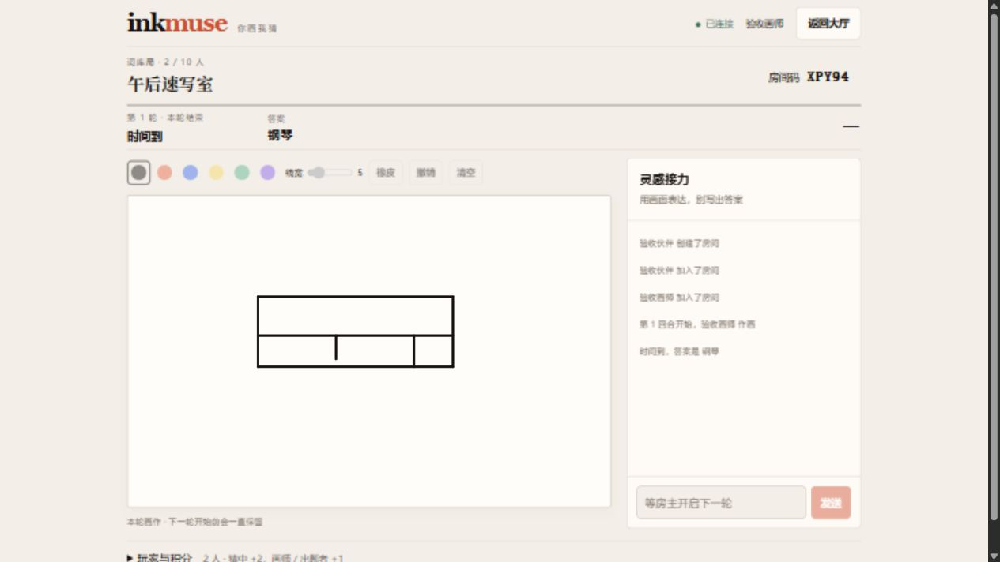

# InkMuse · 你画我猜

给 2–10 位朋友的小画室。React + Express + WebSocket，单进程运行；SQLite 保存词包，房间与临时身份保存在内存中。

试玩入口：[https://170.106.190.20](https://170.106.190.20)（无需域名，可信 HTTPS）。

## 本地运行

使用 Node.js 24 LTS；根目录是 npm workspace。

```sh
npm ci
npm run dev --workspace server
# 另一个终端
npm run dev --workspace client
```

打开 http://localhost:5173。Vite 代理 `/api` 和 `/ws` 到 3001。生产使用构建产物与 HTTPS 代理，见 [VPS 部署](docs/DEPLOYMENT.md)。GitHub Pages 无法单独运行此游戏后端。

## 玩法

- **词库局**：至少 2 人，随机抽词。第一个猜中标准答案的人获胜，匹配忽略大小写与空白。
- **裁定局**：至少 3 人，随机选出题者与画师；其余人猜词，由出题者逐条裁定。出题 30 秒、作画 100 秒。
- 猜中 +2 分，画师与出题者各 +1 分；超时、主动结束、关键玩家离开不加分。结束后保留画作，房主可开启下一轮。
- 实时笔迹、颜色与线宽、橡皮、撤销、清空和触摸绘画。每轮最多 2,000 笔 / 100,000 个采样点，满额会提示而不会丢弃旧画。
- 一位玩家同时属于一个房间；同一身份最多 4 个标签页。最后一个连接断开后保留 60 秒。重启会结束所有房间并要求重新登录，词包不会丢失。
- 大厅可以投稿词包（4–32 个词），管理员通过“词包审核”发布或拒绝投稿。普通接口不公开待审核内容或完整词表。

## 配置

环境变量由启动环境注入，本地不会自动加载 `.env`。生产示例见 [deploy/.env.example](deploy/.env.example)。

| 变量 | 默认值 | 用途 |
| --- | --- | --- |
| HOST | 127.0.0.1 | 后端监听地址 |
| PORT | 3001 | 后端端口 |
| CLIENT_ORIGIN | http://localhost:5173 | 精确浏览器来源，含协议、不带尾部斜线 |
| DATABASE_PATH | server/data/app.db | SQLite 文件，自动创建父目录 |
| ADMIN_KEY | 空 | 空值关闭审核，生产使用独立随机密钥 |
| TRUST_PROXY | 空 | 仅本机可信代理时设为 loopback |

HTTP Bearer token 与 WebSocket token 代表临时身份。HTTP 校验来源、数据与速率；WebSocket 校验来源、消息 schema、成员角色和回合，限制 64 KiB 消息、每 socket 每秒 60 条消息，并有心跳和发送积压保护。`/api/admin/*` 还要求 `x-admin-key`。审核密钥仅保存在弹窗内存中。

会话上限 100、单房间 10 人，适用于小型朋友游戏。匿名公开服务的滥用防护是基础级别；不提供用户账号、跨服务器扩容或持久化对局。旧数据库的 players 表不再使用，升级保留其数据，可在备份后手动清理。

## 验证

```sh
npm test
npm run build
npm run test:load
npm audit --registry=https://registry.npmjs.org
```

测试使用内存数据库。负载脚本默认在随机本机端口启动隔离服务，建立 10 个真实 HTTP/WS 客户端，发送 200 个绘画分块，验证一次重连和结算。可传部署地址：`npm run test:load -- https://YOUR_ADDRESS`。脚本创建专用房间，结束时删除临时身份，勿用于大规模压测。

CI 在 Node 24 / Ubuntu 上执行测试、构建、10 客户端验证和生产依赖审计。服务端 build 执行语法检查。

延迟对照：`node scripts/load-test.mjs --legacy` 与 `node scripts/load-test.mjs` 比较旧版完整同步和紧凑同步，可用 `--clients=3`、`--interval=25` 调整人数与分块间隔。报告分别统计房间、画布增量和 HTTP 响应字节；延迟为脚本发出到收到消息的时间，不包含浏览器绘制。

新版通过 `/ws?compact=1` 协商复用当前连接已经收到的画布；重连和新回合仍发送完整画布。`/api/rounds/*?compact=1` 成功返回 204，权威状态由 WS 同步，避免 HTTP 确认抢先推进状态版本。未协商的客户端保持完整响应。

## UI 开发与体验

基础控件在 `client/src/components/ui/`，来源授权见该目录的 `NOTICE.md`。大厅、对局和词包弹窗按需加载。

开发服务器下访问 `/__ui` 查看基础组件，访问 `/__game` 切换真实游戏组件的角色、回合、断线和慢请求状态。预览不连接实际比赛，生产构建不包含预览代码。

画布聚焦时支持 B 画笔、E 橡皮、Ctrl / ⌘ Z 撤销。猜词使用 Enter 发送，中文组合输入期间不会发送；请求期间可继续输入。投稿弹窗关闭后保留当前页面草稿，刷新或退出会清除。

[UI 方案](docs/UI-EXPERIENCE-PLAN.md) · [验收与限制](docs/UI-ACCEPTANCE.md)

## 结构与记录

- `client/src/components/`：画布、对局、词包与对话框。
- `client/src/hooks/useGameConnection.js`：会话恢复和状态合并。
- `server/src/gameStore.js`：房间、计时、计分与绘画状态。
- `server/src/createApp.js` / `realtime.js`：HTTP / WebSocket 边界。
- [原始审阅](REVIEW-2026-09-15.md) · [分批审查](docs/CHANGE_REVIEW.md) · [计划](task_plan.md)。


