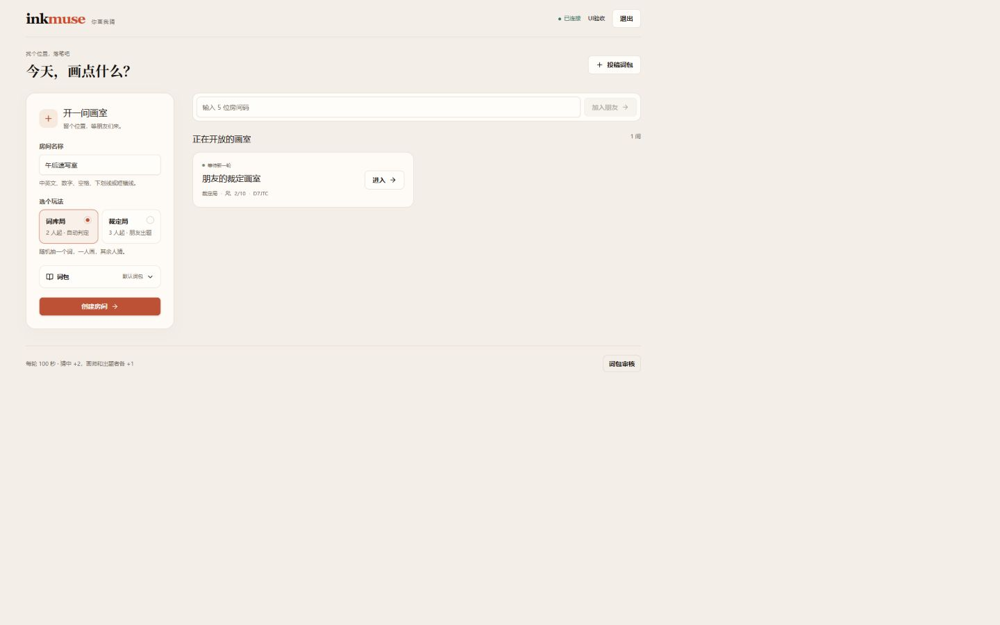

# InkMuse · 你画我猜

给 2–10 位朋友的小画室。React + Express + WebSocket，单实例运行；SQLite 保存词包，房间、积分与临时身份保存在内存。

[在线试玩](https://170.106.190.20) · [稳定版本与交接](docs/HANDOFF.md) · [Agent 接手指南](AGENTS.md)

## 本地运行

使用 Node.js **24.x**，根目录为 npm workspace：

```sh
npm ci
npm run dev --workspace server
# 另一个终端
npm run dev --workspace client
```

打开 http://localhost:5173。Vite 将 `/api` 和 `/ws` 代理到 3001。生产为同源 HTTPS + VPS；GitHub Pages 无法单独承载此后端。

## 玩法

- **词库局**：至少 2 人，随机一人画，其他人猜；标准答案匹配先去首尾空白、合并连续空白、转小写，不会删除词语中的所有空格。
- **裁定局**：至少 3 人，分别选出题者和画师，其他人猜；出题者逐条裁定。出题 30 秒，作画 100 秒。
- 猜中 +2，画师 / 出题者各 +1；超时、房主提前结束、关键玩家离开不加分。结束保留画作，房主手动开始下一轮。
- 支持实时绘画、颜色 / 笔宽、橡皮、撤销、清空和触摸。每轮最多 2,000 笔 / 100,000 点。
- 一个身份只在一个房间，同一身份最多 4 个标签页，最后一个连接断开后保留 60 秒；重启会结束对局并要求重新登录，词包保留。
- 可投稿词包（4–32 个词），管理员在大厅审核发布或删除。普通接口不公开待审核内容与完整词表。

## 配置

环境由启动环境注入，**不自动加载 `.env`**。生产模板：[deploy/.env.example](deploy/.env.example)。

| 变量 | 默认值 | 说明 |
|---|---|---|
| HOST | 127.0.0.1 | 后端监听地址 |
| PORT | 3001 | 后端端口 |
| CLIENT_ORIGIN | http://localhost:5173 | 精确来源，含协议，无尾部斜线 |
| DATABASE_PATH | server/data/app.db | SQLite，自动创建父目录 |
| ADMIN_KEY | 空 | 空值关闭审核；启用时使用独立随机密钥 |
| TRUST_PROXY | 空 | 只有受信本机代理时设为 loopback |

普通 HTTP 使用 Bearer token，WebSocket 使用连接 token；管理接口额外要求 `x-admin-key`。带 Origin 的请求必须匹配 CLIENT_ORIGIN。HTTP 有来源 / 数据 / 速率校验，WS 有消息大小 / 频率 / 积压限制和权限检查。适合小型朋友试玩，不提供账号体系、跨实例扩容或持久化对局。

## 验证与开发

```sh
npm test
npm run build
npm run test:load
npm audit --omit=dev --registry=https://registry.npmjs.org
```

测试使用隔离数据库；十人脚本默认只启动本机隔离服务。CI 在 Node 24 / Ubuntu 执行上述检查。脚本参数和公网测试边界见 [维护规范](docs/MAINTENANCE.md)。

开发环境可访问 `/__ui`（基础控件）和 `/__game`（角色、慢请求及断线场景）；预览不连接实际比赛，也不进入生产构建。基础组件来源见 [NOTICE](client/src/components/ui/NOTICE.md)。

画布聚焦支持 B 画笔、E 橡皮、Ctrl / ⌘ Z 撤销。猜词即时回显，Enter 发送；IME 组合期间不发送，等待确认时可写下一条。投稿草稿仅保留在当前页面，刷新或退出清除。

## 文档导航

| 文档 | 内容 |
|---|---|
| [AGENTS.md](AGENTS.md) | 新 agent 阅读顺序、开发约束与关键不变量 |
| [交接](docs/HANDOFF.md) | 固定基线、验证边界、历史与已知后续事项 |
| [架构](docs/ARCHITECTURE.md) | 模型、API、WS、UI 状态和设计决定 |
| [维护](docs/MAINTENANCE.md) | 分支、测试、审查、发布与清理标准 |
| [部署](docs/DEPLOYMENT.md) | VPS 路径、更新、回滚、备份及故障处理 |
| [延迟证据](docs/LATENCY-RESULTS.md) | 同条件流量 / 延迟对照及测量限制 |
| [UI 验收证据](docs/UI-ACCEPTANCE.md) | 2026-09-16 浏览器验收范围，非本轮真机证明 |


