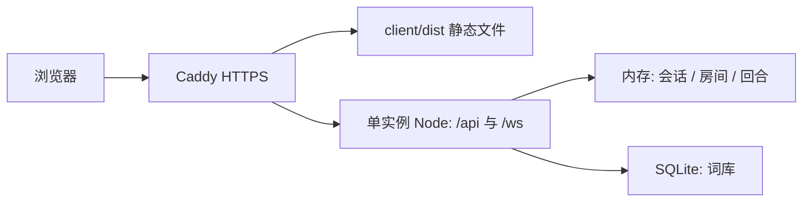

# Draw & Guess 项目审阅

日期：2026-09-15。目标：约 10 人同时在线、朋友房间、两种玩法、绘制顺手、界面舒适、小型 VPS 单实例部署。

## 结论

建议在现有项目上做有边界的重构：优先整理会话与房间状态、回合规则、画布同步协议，再调整对局页布局。React + Vite、Express + ws、SQLite 这套组合符合项目规模。

问题集中在状态约束与多人交互细节；尚无证据说明需要更换框架或重新建项目。现有代码规模较小，核心逻辑集中，修复和拆分可以分批验收。建议完成本文 P1 项和关键对局体验修复后再公开上线。

## 审阅范围与证据

- 阅读了原始需求 `prompt.txt`、README、开发日志、DESIGN 和本地 UI 提示文档，以及前后端全部业务源文件与现有测试。
- 使用 gh 核对远程：`main` 为 `7d858fe64ccf9313ac067d275de0df44617048c7`，与本地 HEAD 一致；当前没有查询到 issue 或 PR。
- 工作区已有 4 个前端文件的未提交修改，以及 AGENTS、DESIGN、UI 提示文档。本次以工作区实际内容审阅。
- Review Changes 技能需要的知识图谱工具在当前会话不可用，采用源码追踪、隔离接口复现、真实 WebSocket 连接和浏览器检查。
- 完成登录、大厅、创建房间、10 个测试连接、开局、猜中、计分与结算的本地检查；检查了 1280×720 和 390×844 两种视口。
- 自定义复现使用内存 SQLite；异常帧验证使用独立子进程。10 个连接只构成流程检查，不能作为 VPS 容量或弱网性能结论。
- 本轮没有修改业务代码、提交 commit、创建 PR 或部署。新增本审阅记录。

## 高优先级问题：P1

### 1. 异常 WebSocket 帧会退出整个服务进程

位置：[realtime.js](F:/codelearn/Draw-and-Guess/server/src/realtime.js:28)。

连接只监听了 `message` 和 `close`，没有处理 socket 的 `error`。`message` 回调里的 try/catch 无法捕获协议解析阶段的错误。

隔离复现：创建临时会话并连接本地 `/ws`，向独立服务进程发送一个无效 opcode 的帧。进程以代码 1 退出，错误为 `Unhandled 'error' event` / `Invalid WebSocket frame: invalid opcode 3`。影响范围为该进程的所有房间。

建议：为连接和服务补齐错误处理与清理；设置合理的消息大小、速率和连接数量限制，并增加异常帧后服务仍能响应健康检查的回归测试。

### 2. 猜词接口没有校验房间成员身份

位置：[gameStore.js](F:/codelearn/Draw-and-Guess/server/src/gameStore.js:266)。

`submitGuess` 只检查回合是否 active，以及提交者是否为画师/出题者。任何其他已登录用户都可以带上大厅里公开的房间码提交猜测。

隔离复现：房间中有两人，第三个用户没有加入房间，直接提交正确答案。接口返回 HTTP 200，回合变为 finished，winnerIds 包含这个外部用户，响应中 `me` 为 null。错误答案也可写入他人的消息记录。

建议：所有房间命令统一验证成员关系、角色和阶段；读取成员专属房间视图时也验证成员身份。补充非成员、离房后旧请求和失效回合请求测试。

### 3. 一个玩家可以同时留在多个房间

位置：[gameStore.js](F:/codelearn/Draw-and-Guess/server/src/gameStore.js:155)、[getRoomForPlayer](F:/codelearn/Draw-and-Guess/server/src/gameStore.js:204)。

加入或创建新房间时，没有处理已有房间成员关系。`session.roomCode` 指向新房间，旧房间的 players 仍保留该用户；bootstrap 又通过遍历找到第一个房间。

隔离复现：同一玩家连续创建两个房间，两个房间都保留其成员；会话指向第二个房间，bootstrap 返回第一个房间。会导致幽灵成员、角色被分配给收不到该房间更新的人，以及刷新后房间错乱。重复点击、多个标签页或直接调用 API 都可能触发。

建议：建立“一个临时会话最多属于一个房间”的约束；加入操作应幂等。切房时由服务端完整离开旧房并通知双方，或明确拒绝切房命令。满员检查应允许已在房内的人恢复连接。

### 4. 重连、重复连接和重启后的身份状态不一致

位置：[bindSocket / unbindSocket](F:/codelearn/Draw-and-Guess/server/src/gameStore.js:64)、[连接认证](F:/codelearn/Draw-and-Guess/server/src/realtime.js:36)、[客户端重连](F:/codelearn/Draw-and-Guess/client/src/App.jsx:347)。

有三个独立场景：

- **新旧连接重叠：**同一 token 先绑定 A、再绑定 B，随后关闭 A，`unbindSocket(A)` 会把当前 B 也置空。之后断线清理可删除仍在使用 B 的会话。本轮验证了 B 被错误置空。
- **服务重启：**SQLite 中的玩家仍能通过 HTTP 认证，但新 GameStore 没有相应 session。模拟创建新的 app/store 后，旧 token 的 bootstrap 返回 200，`bindSocket` 却返回 null；实时层仍发送 connected。用户看似登录成功，实际无法正常绑定房间和画布同步。
- **短暂网络错误：**bootstrap 任意失败都会删除 localStorage 和 session，包括临时断网或服务端 5xx。当前 8 秒保留窗口也较容易被手机切后台等操作超过。

建议：确定唯一的临时会话来源；旧 socket 只能解绑自己。按错误类型决定重试或退出登录；显示连接中、已连接、重连中、会话过期等真实状态。补充心跳检测。

对于这个规模，我倾向临时会话和房间统一保存在内存，断线给予可配置宽限期，例如 60 秒；服务重启后明确提示重新进入大厅。SQLite 负责需要长期保存的词库。若选择保留数据库会话，就必须在恢复时重建内存映射。两种策略需要选定一种并贯彻。

### 5. 画布协议不满足绘制过程实时可见，且会丢笔迹

位置：[CanvasBoard.jsx](F:/codelearn/Draw-and-Guess/client/src/components/CanvasBoard.jsx:42)、[realtime.js](F:/codelearn/Draw-and-Guess/server/src/realtime.js:56)、[addStroke](F:/codelearn/Draw-and-Guess/server/src/gameStore.js:309)。

- 前端只在 pointerUp / pointerLeave 时调用 onStroke。按住连续画时，其他人要等这一笔结束后才能看到。
- 服务端把单笔截为前 512 个点，超出部分静默丢弃。
- 超过 240 笔后只保留最后 240 笔。复现 241 笔后，第一笔已被移除；正常画面会逐渐缺失。
- 每次画笔、清空、猜词等更新都会广播完整 room，包括全部画布和词包。客户端每次收到画布数组都清空并重绘全部笔迹；正在本地绘制但尚未发送的部分也可能被其他房间事件的重绘覆盖。
- 合成 240 笔、每笔 128 点的状态，单个玩家收到的 JSON 约 1.43 MB，10 人一轮广播约 14.3 MB。这是负载大小示例，不是实测带宽或压测结果。

建议：画笔分批发送增量，包含 strokeId 与 roundId；初次进入和重连发送快照。画布消息独立于低频房间状态更新；本地正在绘制的笔迹与已确认笔迹分开维护。达到预算时有明确策略，不应静默删除正常作品。

### 6. 多人答案会互相覆盖，裁判可能判错对象

位置：[submitGuess](F:/codelearn/Draw-and-Guess/server/src/gameStore.js:286)、[judgeGuess](F:/codelearn/Draw-and-Guess/server/src/gameStore.js:293)。

待裁定答案只有一个 `pendingGuess` 槽位，每次提交都会替换。裁定接口只传 guesserId，没有答案 ID。

隔离复现：A 提交正确答案，紧接着 B 提交错误答案，pendingGuess 只剩 B 的答案；裁判裁定 A 时收到 `GUESS_NOT_PENDING`。同一个人快速连续提交两个不同答案时，裁判旧界面的点击还可能作用于新答案。

建议：每条猜测拥有稳定 guessId，记录 pending / accepted / rejected 状态；裁定绑定具体 guessId 和 roundId。裁判直接从消息流判定，前端保留待裁定条目，避免额外复制一套答案数据。

### 7. WebSocket 载荷缺少结构校验

位置：[realtime.js](F:/codelearn/Draw-and-Guess/server/src/realtime.js:49)、[drawStroke](F:/codelearn/Draw-and-Guess/client/src/components/CanvasBoard.jsx:3)。

当前只判断 points 是数组，然后切片；不检查每个点、坐标、颜色的类型和范围。实际连接复现确认 `[null]` 被存入房间并广播；前端随后访问 `first.x` 的代码无法处理 null，会抛出异常。

运行时检查还确认：maxPayload 为默认的 104857600 字节（100 MiB）；任意未识别的消息类型也会执行完整房间广播；不同 Origin 的连接能通过。HTTP 的安全中间件不会自动作用于 WebSocket upgrade。

建议：通过共享、明确的 schema 校验实时命令，限制有限数值坐标、单批点数、消息字节数和频率；未知消息直接拒绝。校验握手来源，但仍以 token 和成员/角色校验作为权限依据。不要把 Origin 校验当作认证。

## 中优先级问题：P2

### 8. 大厅房间列表不会实时更新

位置：[broadcastRoom](F:/codelearn/Draw-and-Guess/server/src/realtime.js:14)。

广播只发给 session.roomCode 等于目标房间的连接，大厅中的人收不到新建、加入、离开、删除等变化；前端也没有定时刷新大厅。

两个真实 WebSocket 的隔离复现中，创建房间的连接收到 connected、room:update，大厅连接只收到最初的 connected，仍显示空大厅。

建议：增加精简的 lobby:update，房间成员和生命周期发生变化时发给大厅订阅者。游戏画笔不需要携带大厅列表。

### 9. 回合阶段缺少约束，结束路径不足

位置：[startRound](F:/codelearn/Draw-and-Guess/server/src/gameStore.js:217)、[StatusPanel](F:/codelearn/Draw-and-Guess/client/src/App.jsx:165)。

已复现的行为：

- 裁定局允许两人开局，分别成为画师和出题者，猜词者数量为 0。
- 正在作画或等待出题时，房主可再次开始回合，立即覆盖当前题目与画布；按钮也一直可点。
- `addStroke` / `clearCanvas` 只验证画师身份，不验证回合阶段。

功能缺口：`roundSeconds: 100` 仅出现在配置中，没有真正的倒计时或超时结算；无人猜中或出题者不出题时缺少自然结束路径。`startedAt` 在提交题目时也未重置。计时、出题超时、跳过和下一轮策略应在下一轮产品规则中明确。

建议：用小型显式状态转换函数管理 waiting → collecting-word → active → finished；按模式设置最少人数。服务端管理截止时间，客户端只负责显示。补齐重复开局、过期命令、角色离开和无人猜中测试。

### 10. 界面信息主次与游戏动作不匹配

位置：[房间布局](F:/codelearn/Draw-and-Guess/client/src/App.jsx:633)、[网格布局](F:/codelearn/Draw-and-Guess/client/src/styles.css:249)、[响应式布局](F:/codelearn/Draw-and-Guess/client/src/styles.css:1106)。

十人房间、标准词库局、猜词者视角的浏览器测量：

| 视口 | 画布距页面顶部 | 画布显示尺寸 | 猜词输入框 | 页面高度 |
| --- | ---: | ---: | --- | ---: |
| 1280×720 | 约 1197px | 738×461px | 右侧上方，与画布分离 | 约 1803px |
| 390×844 | 约 1346px | 276×173px | 顶部约 1638px | 约 3463px |

测量时页面位于顶部；数值会随字体、角色和消息变化，但主问题稳定存在：大标题、说明、状态卡片占去主要空间，手机端又把它们逐个纵向排开。

其他观察：

- 首页和大厅含有“这一版”“大厅像一面演出排期墙”等设计说明，以及 HTTP + WebSocket 等实现信息。应换成玩家需要的玩法与邀请提示。
- “房间连接稳定”是固定文案，没有绑定连接健康状态。
- 10 个玩家的大卡片挤占侧栏，聊天/猜测记录在其后；消息流没有自动跟随最新消息。
- 回合结束立即清空作品（[finishRound](F:/codelearn/Draw-and-Guess/server/src/gameStore.js:358)），削弱了作品展示和结算体验。
- 绘制区尚无 touch-action、pointer capture / cancel 的处理；本轮没有做真机触摸验证。模态层也缺少 dialog 语义、Escape 关闭和焦点管理。

建议延续暖纸色、墨色和少量橙色的方向，重排布局：顶部一条紧凑回合信息；桌面中部为画布、右侧为猜词流与输入；玩家用紧凑头像/分数条。手机优先展示画布与输入，其他内容折叠。结算保留画作，并展示答案、得分变化和下一步。

### 11. 词库审核与生产配置还有缺口

- [config.js](F:/codelearn/Draw-and-Guess/server/src/config.js:6) 在没有配置 ADMIN_KEY 时使用公开默认值。本轮在默认配置下，用普通临时会话加此默认值访问管理员接口成功。公开部署必须显式配置强密钥，缺失时应禁用管理接口或拒绝启动。若按默认值上线，此项优先级升为 P1。
- [createApp.js](F:/codelearn/Draw-and-Guess/server/src/createApp.js:221) 投稿成功后，向普通投稿者返回所有词包，包括其他人的 pending 词包及完整词条，绕过“审核后公布”的数据边界。建议仅返回自己的提交结果和审核状态。
- 重复词包名会触发 SQLite 唯一约束并返回通用 500，表单也没有清楚展示长度、字数等约束。应转换为可理解的字段错误。
- 管理员只有接口，尚无便于日常审核的小页面；这一点是功能缺口，可以在核心对局稳定后补齐。
- [security.js](F:/codelearn/Draw-and-Guess/server/src/security.js:3) 按 req.ip 计数但不清理闲置桶。反向代理部署还需正确配置受信代理，否则不同用户会被识别为代理的同一个 IP、共用配额。[Express 官方说明](https://expressjs.com/en/guide/behind-proxies/)

### 12. 测试覆盖不足，且未隔离默认数据库

位置：[createApp.test.js](F:/codelearn/Draw-and-Guess/server/src/createApp.test.js:13)、[server/vitest.config.js](F:/codelearn/Draw-and-Guess/server/vitest.config.js:3)。

当前仅有 3 个服务端测试、1 个前端登录页测试。没有实时层、多连接、裁判流程或画布测试。测试导入真实 db.js，beforeEach 调用 resetPlayers，未设置独立 DATABASE_PATH。

本轮首次执行现有 `npm test` 时，也触发了默认数据库 players 表的重置。后续自定义验证全部使用 `:memory:` 数据库。今后应先让测试数据库完全隔离，再扩充回归用例。

最值得补充的测试是上述已复现故障对应的行为，以及两种模式从进入到结算、刷新恢复、房主/关键角色离开、240 笔以上和长笔画。前端至少增加真实协议驱动的主要交互测试，配少量多客户端端到端检查。

## 工程判断

值得保留的基础：

- npm workspace 的前后端边界清楚，启动和构建简单。
- HTTP 路由与 GameStore 已分离，便于直接测试游戏规则。
- Zod 校验、参数化 SQL、词包写入事务已经存在；应补齐使用范围。
- 角色选择已有按累计次数和近期记录避重的策略，适合继续验证和小幅调整。

值得调整的边界：

- App.jsx 约 840 行，同时包含网络连接、会话恢复、表单、状态反馈和主要页面；styles.css 约 1179 行。可将会话/连接逻辑提取为少量 hooks，拆出 Lobby、GameRoom、GuessFeed、RoundResult；保留已有 CanvasBoard。
- GameStore 约 386 行，不需要机械拆成很多层。先把成员约束、回合转换和消息模型理清；会话连接管理可独立为一个小模块。
- HTTP 命令与 WS 事件应共用一套权限、阶段检查和错误码；前端通过一处逻辑应用状态，避免双通道各自覆盖 room。
- 词包列表只需元数据时，返回名字、简介、词数等；完整词条保留在确实需要的接口。
- README、开发日志对断线删除/保留的描述已经不一致。建议增加一页具体游戏规则与验收标准，明确两种模式最少人数、计分、超时、离房、断线和重启行为。

## 推荐部署形态

建议使用现有 VPS，把前端静态文件和 API / WebSocket 放在同一个域名下。

这是结合当前同源 `/api`、`/ws` 实现提出的方案。Caddy 可以同时提供静态文件和反向代理，部署时需为 API 与实时连接配置各自匹配规则。[Caddy 官方示例](https://caddyserver.com/docs/caddyfile/patterns)

GitHub Pages 是静态托管，当前 Express、WebSocket 和 SQLite 后端仍需另外运行。既然已有 VPS，同源部署可减少跨域、后端地址和分开发布的配置负担。[GitHub Pages 官方说明](https://docs.github.com/en/pages/getting-started-with-github-pages/what-is-github-pages)

最小上线交付应包含：固定 Node 版本、npm ci、前端构建、systemd 单进程守护、HTTPS 与反代、受信代理和后端监听范围、明确的 ADMIN_KEY / CLIENT_ORIGIN / DATABASE_PATH、SQLite 持久目录及备份恢复方法、健康检查、日志和简单回滚。GitHub Actions 先负责测试和构建即可。

10 人只是产品容量目标，不能凭空推断具体 VPS 上的延迟和带宽。完成增量画布后，再在目标机器上检查 10 个活跃客户端持续绘制、猜词和重连时的 CPU、内存、带宽及延迟。

## 依赖检查与验证结果

| 检查 | 结果 |
| --- | --- |
| npm test | 通过：服务端 3 项，客户端 1 项 |
| npm run build | 通过；前端 JS 约 220 kB、gzip 约 68.5 kB；服务端 build 是占位步骤 |
| 多人流程 | 10 个本地连接、标准词库局开局/猜中/计分/结算通过 |
| 异常与边界复现 | 上文的非成员猜词、多房间、连接覆盖、重启身份、裁定覆盖、两人裁定局、重开回合、笔迹淘汰、大厅广播、无效点广播、异常帧退出均得到复现证据 |
| npm audit（官方 registry） | 共 12 个受影响依赖项：1 critical / 6 high / 3 moderate / 2 low |
| npm audit --omit=dev | 4 项：ws、nanoid、qs、body-parser；2 high / 1 moderate / 1 low |

默认 npm 镜像不提供 audit 接口，本轮通过命令参数改用官方 registry；没有修改 npm 配置或执行依赖升级。

当前安装的 ws 为 8.20.0，命中官方披露的分片导致内存耗尽问题，8.21.0 修复。该依赖问题与上文已复现的应用层“未处理 error”问题独立，需要分别处理。[ws 官方安全公告](https://github.com/websockets/ws/security/advisories/GHSA-96hv-2xvq-fx4p)

依赖扫描的严重级别不等于本应用中可达的利用路径。例如 critical 项涉及 Vitest UI 服务运行场景，而现有脚本使用 vitest run；nanoid 的调用也使用固定长度。应按实际入口评估、在兼容范围升级并复测。[Vitest 官方安全公告](https://github.com/vitest-dev/vitest/security/advisories/GHSA-5xrq-8626-4rwp)

## 建议实施顺序

| 阶段 | 范围 | 完成标准 |
| --- | --- | --- |
| 1. 对局可靠性 | 隔离测试库；修成员/会话/连接；处理实时错误；裁定绑定答案；约束回合阶段；修大厅广播 | 已复现故障有回归保护，两种模式多人流程及刷新/离开正常 |
| 2. 绘画与玩法 | 增量同步、长笔画、点按、触摸处理、撤销/橡皮；服务端计时；保留结算画作；完善猜词历史 | 其他玩家在一笔未结束时即可看到绘制；普通绘画不丢失；所有回合都有明确结束路径 |
| 3. 布局与反馈 | 紧凑回合栏、画布与猜词流相邻、玩家条、手机布局、实际连接状态、字段错误和提交反馈 | 桌面首屏可用画布与猜词输入；手机可连续观察和作答；关键动作有清楚反馈 |
| 4. 上线 | 兼容升级依赖；VPS 同源部署；CI、备份、日志、回滚；目标机器 10 人负载检查 | 可重复部署，重启/故障行为明确，负载测试满足实际体验目标 |

建议从第 1 阶段开始做一个范围明确的修复批次，再按阶段持续交付。视觉方案和结构调整都以真实对局来验收。
